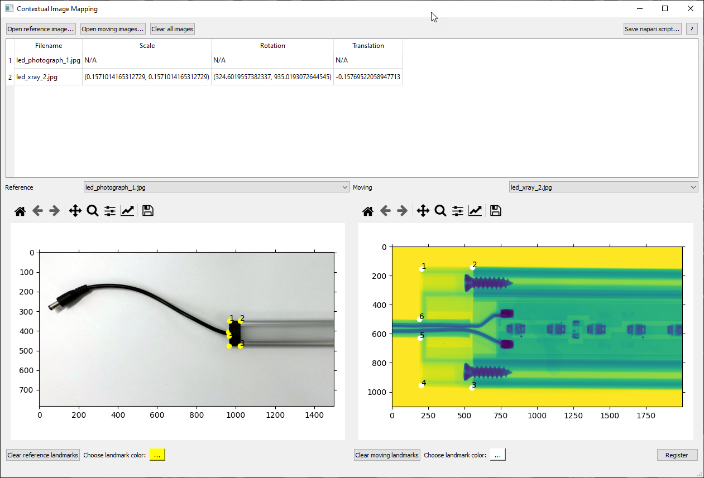

# Contextual Image Mapping
 Align a series of images to a single reference using landmarks, then create a
 napari script to open them in the context of one another.

## Go from this...

## ...to this!

## Quick Start
1. Download this repository as a .zip and extract
2. Install requirements from `requirements.py`
3. Run `main.py`
4. Click the "?" button in the top-right of the CIM window to open the documentation
5. Navigate to the "Quick Start" page of the documentation for brief instructions
   about how to use CIM