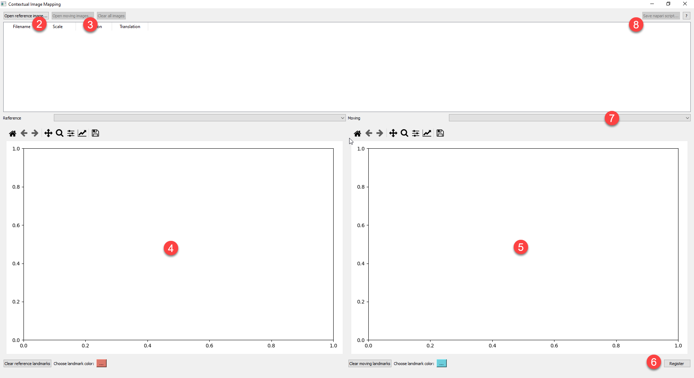

# Contextual Image Mapping
 Align a series of images to a single reference using landmarks, then create a
 napari script to open them in the context of one another. 

## Quick Start
1. Run `main.py`
2. Open a reference image using "Open reference image..." in the top-left
3. Open at least one moving image using "Open moving images..." in the top-left
4. Double-click inside the reference image on the left to add a landmark,
5. Double-click inside the moving image on the right to add a corresponding landmark
   * Note that these landmarks are **ordered** - you **must** add them to the reference
     and moving images in the same order.
     * There are small numbers labeling each landmark to help you keep track of the order.
     
   * It does not matter if you start on the reference or moving image first, jump
     back and forth between them, put all landmarks on one image first then move to the
     other, etc.
     
   * If you make a mistake on one of the images, you can clear the landmarks for them
     independently using the provided buttons.
     
   * Use the widgets in the toolbars above each of the images to zoom, translate, etc.
     See documentation on these toolbars [here](https://matplotlib.org/3.2.2/users/navigation_toolbar.html).
     
6. When at least two landmarks are added to each image, you can click the "Register" button
in the bottom-right to compute a registration matrix for that moving image.
   
   * This matrix is updated in the table.
 
7. If you opened multiple moving images, select another moving image in the dropdown above
   the moving image display to repeat for more of them.
   
8. When you are finished registering the images you want, click the "Save napari script..."
button in the top-right.
   
   * Run this script separately and napari will open with each of the registered images as
     a new layer with the proper transform applied.
     
Numbered steps above correspond to the locations indicated in the screenshot below:

